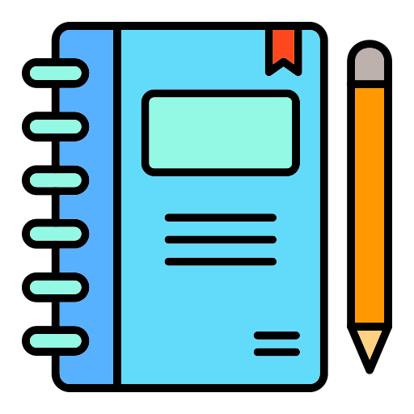

# Scratchpad Repository

Welcome to the Scratchpad repository! This is a place where you can experiment with different coding language paradigms and explore various programming concepts. Whether you're a seasoned developer looking to try something new or a beginner eager to learn, this repository is your playground.

## Table of Contents
- [Introduction](#introduction)
- [Getting Started](#getting-started)
- [Languages](#languages)
- [How to Use](#how-to-use)

## Introduction

Coding is not just about solving problems; it's also about understanding different ways to approach them. Scratchpad is designed to facilitate that exploration. Here, you can find code examples, exercises, and projects in various programming languages, each highlighting a different paradigm or concept. Dive into functional programming, object-oriented programming, logic programming, and more.

## Getting Started

To get started with Scratchpad, follow these simple steps:

1. **Clone the Repository:**
git clone https://github.com/abhishekp03/scratchpad.git

2. **Explore the Languages Directory:**
Inside the repository, you'll find a directory for each programming language or paradigm. Pick the one you want to explore.

3. **Start Coding:**
Open the language directory, and you'll find code examples, exercises, and README files to guide you. Feel free to modify and experiment with the code.

4. **Learn and Share:**
Use this repository to learn, practice, and share your knowledge. Don't hesitate to create your own code samples or projects to contribute back to the community.

## Languages
Here are some of the programming languages and paradigms you can explore in this repository:

- [Java](java/) - A popular, object-oriented language used in a variety of applications.
- [Go](go/) - Go is an open source programming language that makes it simple to build secure, scalable systems.

## How to Use

Each language directory contains its own set of README files and code samples. Here's a general guideline on how to navigate them:

- **README:** Start with the README file in your chosen language directory. It will provide an overview of the paradigm, language-specific tips, and recommended resources.

- **Code Examples:** Explore the code examples to see the paradigm in action. These examples are meant to be educational and showcase common programming tasks.

- **Exercises:** Test your understanding by working on the provided exercises. They range from beginner to advanced levels, so there's something for everyone.

- **Projects:** If available, check out complete projects that demonstrate the practical application of the language or paradigm.

Happy coding and exploring! 🚀

